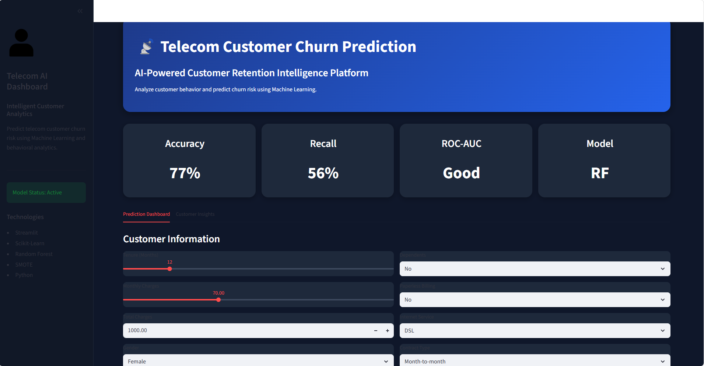

# 📡 Telecom Customer Churn Prediction System

## 📌 Project Overview

This project focuses on predicting customer churn in a telecom company using Machine Learning techniques. The goal is to identify customers who are likely to discontinue telecom services based on customer demographics, account information, billing patterns, and service usage.

The project includes:

- Data preprocessing
- Exploratory Data Analysis (EDA)
- Handling imbalanced data using SMOTE
- Machine Learning model training and evaluation
- Hyperparameter tuning
- Feature importance analysis
- ROC-AUC performance evaluation
- Interactive Streamlit web application deployment

---

# 🚀 Live Application

https://telecom-churn-prediction-app-bvkbj8kf66utmem5e63ybv.streamlit.app/
```

---

📊 Problem Statement

Customer churn is a major issue in the telecom industry. Retaining existing customers is often more cost-effective than acquiring new ones.

This project aims to:

- Predict customer churn accurately
- Identify key factors influencing churn
- Provide business insights for customer retention
- Build an interactive dashboard for churn prediction

---

# 🧠 Machine Learning Workflow

## 1️⃣ Data Collection

The dataset contains telecom customer information including:

- Customer demographics
- Contract details
- Internet services
- Payment methods
- Billing information
- Churn status

---

## 2️⃣ Data Preprocessing

The following preprocessing steps were performed:

- Handling missing values
- Removing unnecessary columns
- Encoding categorical variables
- Feature scaling
- Train-test splitting

---

## 3️⃣ Handling Imbalanced Dataset

The target variable (`Churn`) was imbalanced:

| Class | Percentage |
|---|---|
| No Churn | 73.5% |
| Churn | 26.5% |

To address this issue:

✅ SMOTE (Synthetic Minority Oversampling Technique) was applied ONLY to the training dataset to avoid data leakage.

---

# 📈 Exploratory Data Analysis (EDA)

Several visualizations and statistical analyses were performed to understand customer behavior and churn patterns.

## Key Insights

### 🔹 Customers with shorter tenure are more likely to churn

New customers demonstrated significantly higher churn rates compared to long-term customers.

---

### 🔹 Higher monthly charges increase churn probability

Customers with expensive monthly subscriptions showed increased churn tendencies.

---

### 🔹 Contract type strongly affects churn

Month-to-month customers had substantially higher churn rates compared to one-year and two-year contract customers.

---

### 🔹 Electronic check payment method showed higher churn

Customers using electronic check payments were more likely to churn.

---

### 🔹 Gender had relatively low impact on churn

Demographic variables contributed less compared to billing and service-related variables.

---

# 🤖 Machine Learning Models Used

The following models were trained and evaluated:

| Model | Accuracy | Precision | Recall | F1 Score |
|---|---|---|---|---|
| Logistic Regression | 77% | 56% | 60% | 58% |
| Decision Tree | 72% | 47% | 51% | 49% |
| Random Forest | 77% | 57% | 56% | 56% |

---

# 🏆 Best Model

## Random Forest Classifier

The Random Forest model was selected as the final predictive model because it:

✅ Handled nonlinear relationships effectively  
✅ Produced strong predictive performance  
✅ Provided feature importance analysis  
✅ Generalized better on unseen data  

---

# ⚙️ Hyperparameter Tuning

GridSearchCV was used to optimize the Random Forest model parameters.

## Tuned Parameters Included:

- Number of estimators
- Maximum depth
- Minimum samples split
- Minimum samples leaf

---

# 📌 Feature Importance

The top features influencing customer churn were:

1. Tenure
2. Total Charges
3. Monthly Charges
4. Contract Type
5. Internet Service (Fiber Optic)
6. Payment Method
7. Paperless Billing

---

# 📉 ROC-AUC Evaluation

ROC Curve and AUC score were used to evaluate model performance.

The model demonstrated good classification capability in distinguishing churn and non-churn customers.

---

# 🖥️ Streamlit Web Application

An interactive Streamlit dashboard was developed to:

✅ Input customer information  
✅ Predict churn probability  
✅ Display churn risk level  
✅ Visualize customer risk insights  

---

# 🛠️ Technologies Used

## Programming Language
- Python

## Libraries
- Pandas
- NumPy
- Scikit-Learn
- Imbalanced-Learn
- Matplotlib
- Seaborn
- Streamlit
- Pickle

---

# 📂 Project Structure

```bash
Customer-Churn-Project/
│
├── telcom_app.py
├── best_churn_model.pkl
├── scaler.pkl
├── selected_features.pkl
├── requirements.txt
├── README.md
├── telecom_churn.ipynb
└── dataset.csv
```

---


# 📷 Application Preview

## Telecom Churn Dashboard



```

---

# 📊 Business Impact

This project can help telecom companies:

✅ Improve customer retention  
✅ Reduce revenue loss  
✅ Identify high-risk customers early  
✅ Optimize customer engagement strategies  

---

# 🔮 Future Improvements

Possible future enhancements include:

- SHAP explainability integration
- Real-time customer analytics
- Deep learning models
- Cloud deployment
- Database integration
- Multi-page dashboard architecture

---

# 👨‍💻 Author

## Egbeobauwaye Nagbons

### Data Scientist | Machine Learning Enthusiast | Data Analyst

## GitHub
https://github.com/Nagbons/

## LinkedIn
https://www.linkedin.com/in/nagbonsegbeobauwaye/

---

# ⭐ If You Found This Project Useful

Please consider giving the repository a star ⭐
